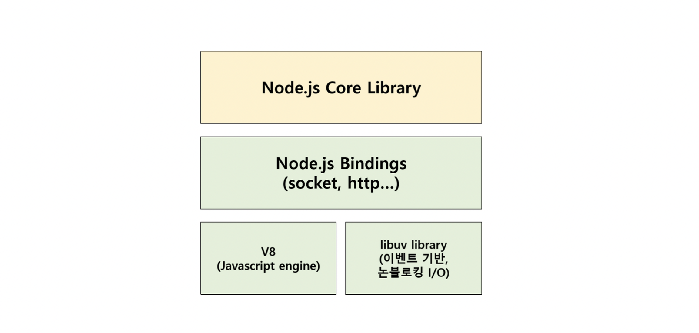

# 개발 환경 

## Node.js란?

Node.js 관련하여 공식 홈페이지에서는 아래와 같이 설명하고 있다.

```text
  Node.js는 Chrome V8 JavaScript 엔진으로 빌드된 JavaScript 런타임입니다.
  Node.js는 이벤트 기반, 논 블로킹 I/O 모델을 사용해 가볍고 효율적입니다. 
  Node.js의 패키지 생태계인 npm은 세계에서 가장 큰 오픈 소스 라이브러리 생태계이기도 합니다.
```



Node.js는 Chrome V8 JavaScript 엔진으로 빌드된 JavaScript 런타임이며, **이벤트 기반 시스템으로 구성**되어 있기 때문에 **비동기를 구현**할 수 있고, 이 덕분에 **Non-Blocking**을 **싱글 스레드**로 수행할 수 있다.

- `Single Thread` \
  스레드는 프로세스 실행 흐름으로, 싱글 스레드란 하나의 프로세스에서 한 가지 작업을 실행하기 위해 순차적으로 실행되는 하나의 흐름이다.
- `Non-Blocking I/O 모델` \
  Node.js 프로세스에서 하나의 작업을 실행한다고 가정하였을 때 다른 작업이 완료될 때까지 기다려야하는 방식이며, Non-Blocking은 그의 반대이다. 즉, 하나의 작업이 실행되어 끝나지 않은 상태에서도 다른 작업이 실행될 수 있다.
- `이벤트 기반` \
  
  특정 이벤트가 발생할 때까지 대기했다가, 발생하면 지정된 작업을 수행하는 방식(자세한 내용은 `JavaScript 이벤트 동작원리` 참고)

## NPM(Node Package Manager)이란?

NPM은 `Node Package Manager`로 `Node Package` 들을 관리해주는 툴이다.

NPM의 문제점으로는 각 패키지들이 서로 의존되어 있는 경우가 많아 하나의 문제 발생 시 다른 것들까지 기능을 하지 않을 수 있다.

이러한 문제를 관리하기 위해 `package.json`에서 의존성을 관리합니다. 즉, 애플리케이션 종속성 및 기타 정보들을 저장합니다.

추가적으로 `package-lock.json`에 대해서 알아보자.

이전에 이야기한대로 `package.json`은 각 버전 정보들을 의존성 있게 관리합니다. 이를 통해 개발환경을 구성합니다. `package.json` 파일의 의존성 선언에는 `version range`가 사용됩니다. `version range`는 특정 버전이 아닌 버전의 범위를 의미합니다. 예를 들어 아래 예제를 보자.

```bash
npm install <패키지명>
```

위와 같이 실행하였을 때, `package.json` 파일에 `<패키지명>^1.53`로 버전이 추가됩니다. 우리는 `package.json` 파일로 `npm install`을 실행하면 의도에 맞지 않게 버전이 `1.6.1`, `1.53`와 같은 업데이트 버전이 설치됩니다. 이러한 경우 간혹 `npm install`시 오류를 발생하곤 합니다. `npm install` 시 이를 해결하기 위해 `package-lock.json` 파일이 생성되며, 파일은 **의존성 트리**에 대한 정보를 가지고 있으며, 이를 통해 모든 패키지들의 `정확한 버전정보` 들을 추적하여 설치가 가능해 집니다.

### node_modules

`npm install`을 실행하면 `package.json` 파일에 맞춰 설치를 진행하며, `node_modules` 디렉토리를 생성하고 `node_modules` 디렉토리 안에 실제 모듈들이 설치됩니다.

### npx(Execute Npm Package Binaries) 란?

npm에서 제공해주는 하나의 도구이며, npm 패키지 실행 도구이다. 실행 도구는 `/node_modules/.bin/` 안에 있는 실행 파일을 아래와 같이 실행할 수 있습니다.

```bash
./node_modules/.bin/eslint init

npx eslint --init
```

## ES Modules vs CommonJS

JavaScript 내에서 모듈의 실행은 `import(가져오기)`, `export(내보내기)`에 따라 달라집니다. 현재는 두 가지 모듈 시스템인 `ES Modules`와 `CommonJS` 모듈 시스템이 사용되고 있다.

### ES Modules란?

```js
import foo from 'foo.js';
import { fn } from 'fn.js';

export const foo = 'boo';
export default fn = () => {};
```

ES6에 도입된 모듈 시스템으로, `import`, `export`를 사용해 분리된 자바스크립트를 서로 파일끼리 접근할 수 있게 해준다.

`ES Modules`의 진행 순서는 아래 3단계로 나누어진다.

1. 구성 - 모든 파일을 찾아 다운로드하고 모듈 레코드를 구문분석한다.
2. 인스턴스 화 - `export`된 값을 모두 배치하기 위해 메모리에 있는 공간들을 찾는다(실제 값은 채우지 않음). 그 이후 `export`와 `import`들이 이런 메모리 공간들을 가르키도록 하여 연결시킨다.
3. 평가 - 코드를 실행하여, 메모리에 값을 부여한다.

**더 자세한건 이후에 보충**

### CommonJS란?

```js
const foo = require('foo.js');
const { fn } = require('fn.js');

module.exports = 'foo';
module.exports.fn = () => {};
```

`Node.js` 환경에서 자바스크립트 모듈을 사용하기 위해 만들어진 모듈이다. `require`과 `exports`를 사용해 분리된 자바스크립트를 서로 파일끼리 접근할 수 있게 해준다.

**더 자세한건 이후에 보충**

## 중요 용어 정리

- `Chrome V8 JavaScript 엔진` \
웹 브라우저를 만드는 데 기반을 제공하는 오픈 소스 자바스크립트 엔진(구글 크롬 브라우저와 안드로이드 브라우저가 탑재되어 있음)이며, JavaScript를 바이트코드(bytecode)로 컴파일하고 실행하는 방식을 사용한다.
- `런타임` \
특정 언어로 만든 프로그램을 실행할 수 있는 환경
- `Blocking` \
Node.js 프로세스에서 하나의 작업을 실행한다고 가정하였을 때 다른 작업이 완료될 때까지 기다려야하는 방식이며, Non-Blocking은 그의 반대이다. 즉, 하나의 작업이 실행되어 끝나지 않은 상태에서도 다른 작업이 실행될 수 있다.
