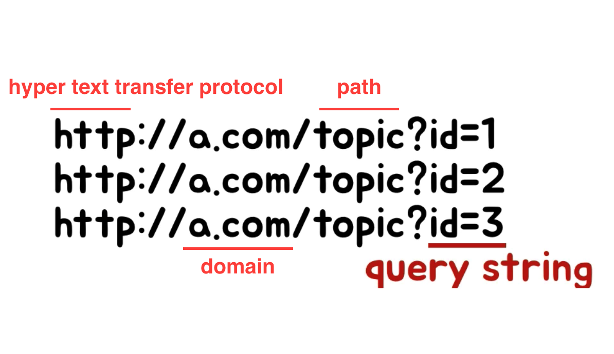

# Express

## Express란?

`Express`는 웹 및 모바일 애플리케이션을 위한 일련의 강력한 기능으 제공하는 간결하고 유연한 `Node.js` **웹 애플리케이션 프레임워크**이다. `Node.js`는 표준 웹서버 프레임워크로 많은 곳에서 사용하고 있다.

> 서버를 구성할 수 있게 만든 클래스와 라이브러리의 집합체

### 특징

- 자유롭게 활용할 수 있는 수많은 **HTTP 유틸리티 메소드 및 미들웨어를 통해 쉽고 빠르게 강력한 API를 작성 가능**하다.
- 기본적인 웹 애플리케이션 기능으로 구성된 얇은 계층을 제공하여, 여러분이 알고 있고 선호하는 Node.js 기능을 모호하게 만들지 않습니다.
- 웹 어플리케이션을 만들기 위한 라이브러리와 미들웨어 등이 내장되어 있어 개발하기 편하며, 수많은 개발자들에게 `개발 규칙을 강제하여 코드 및 통일성`을 향상 시킬 수 있다.

## URL 구조

### 쿼리 스트링

- `path`: <http://a.com/login> 에서 /login 부분
- `하나의 path(라우터)`에서 경우에 따라 다른 결과를 보여주기 위해서는 `쿼리스트링`이 사용된다.
- `쿼리스트링`은 어떤 애플리케이션에게 정보를 전달할 때 사용되는 URL에 약속되어 있는 국제적인 표준



### query 객체의 사용

동적인 파일을 통해서 `쿼리스트링 사용`에 대해 살펴보자.

- url내의 `쿼리스트링`을 가져오려면 `req.query`를 사용해야한다.
- 복수의 `쿼리스트링`을 가져오는 것도 가능하다.

> [express api reference(req.query)](https://expressjs.com/ko/4x/api.html) 를 참고하여 사용

```js
app.get('/topic', function(req, res) {
  // url이 http://a.com/topic?id=1&name=jinwoo 일때
  res.send(req.query.id+','+req.query.name); // 1,jinwoo 출력
})
```

### 의미론적인 URL (semantic url)

구조적인 URL로 사용자에게 친숙한 URL

`일반 URL`: `board.php?id=notice&mode=list&page=1` \
-> `시멘틱 URL`: `board/notice/list/1`

#### 장점

- 한눈에 보기 쉬운 깔끔한 URL을 유지할 수 있다.
- 사용자가 URL을 기억하기 쉽다.
- SEO적으로 도움이 된다.

## Rest API

HTTP를 잘 사용하기 위해, REST 아키텍쳐 스타일을 모두 준수한 API이다.

대부분 아래와 같이 많이 이해한다.

```none
REST API란, UR에 접근할 자원을 명시하고, 행위를 HTTP 메소드로 표현하여, 그 의도를 명확하게 표현하고 해당 자원에 대한 CRUD 오퍼레이션을 적용한 것
```

하지만 REST를 만든 로이 필딩은 `REST API`가 아니라고 한다. 

```none
내 논문 어디에도 CRUD에 대한 내용이 없다.
HTTP 메소드는 REST가 아니라 웹의 아키텍쳐 스타일의 일부이다.

- it is okay to use POST (2009.03.20)
```

### REST란

REST란 `HTTP 를 잘 사용하기 위한 아키텍쳐 스타일`이다.

> 그럼 REST API는 무엇인가?

REST API는 `REST한 방식으로 데이터를 상호교환 하도록 설계된 API`이다.


### REST 아키텍쳐 스타일

1. client-server
2. stateless
3. cache
4. uniform interface
5. layered system
6. code-on-demand(optional)

위의 스타일 중 `uniform interface`를 제외한 5가지는 `HTTP API`로만으로 잘 지켜지지만 `uniform interface`에 대한 부분이 잘 지켜지지 않는다.

#### Uniform Interface의 제약 조건

1. `identification of resources(자원의 식별)` - 리소스가 uri로 식별되야 함
2. `manipulation of resources through representations(표현을 통한 자원의 조작)` - representations을 통해서 자원을 조작해야 한다.
3. `self-descriptive messages(자기 서술적 메세지)` - 스스로 설명하는 메시지가 되어야 한다.
4. `HATEOAS(hypermedia as the engin of application state)` - 애플리케이션의 상태가 Hyperlink를 통해서 전이되어야 한다.

특히 `self-descriptive messages`와 `HATEOAS`가 안지켜진다.

- `self-descriptive messages(자기 서술적 메세지)`

  API의 목적지가 어디인지 명확하게 알려줘야한다.

  **Host 헤더에 도메인명 기재 필요!**

  ```none
  GET / HTTP/1.1
  Host: www.example.prg
  ```

  `Media-Type`을 추가함으로 명세를 찾아 의미하는 것을 표현

  ```none
  GET / HTTP/1.1 200 OK
  Content-Type: application/json-patch+json

  [ { "op": "remove", "path": "/a/b/c" } ]
  ```

- `HATEOAS`

  HTML과 같은 하이퍼미디어를 통해 클라이언트가 앱 상태 변경할 수 있는 인터페이스를 제공해야한다. 즉 숨겨진 인터페이스가 존재한다면, 이를 위해하는 행위이다.

  JSON에 `URI` 등 포함을 해서 보내야한다.

  ```none
  [
    {
      "link": "https://example.org/todos/1",
      "title": 공부하기"
    }
  ]
  ```

## CURD란?

대부분의 소프트웨어가 가지는 기본적인 데이터 처리 기능은 `Create(생성)`, `Read(읽기)`, `Update(갱신)`, `Delete(삭제)`를 묶어서 일컫는 말이다.

## 정리

대개는 위에서 설명한대로 `필딩 제약 조건` 모두 만족하지 않고, `Resource`와 `HTTP Verb`만 도입하는 수준으로 사용한다.

- 잘못된 표현: `/write-post`
- 정확한 표현: `/posts` → 뭔가를 한다 (`CRUD`)

`CRUD`에 대해 HTTP Method를 대입. Read는 `Collection(복수)`과 `Item(Element)(단수)`로 나뉨.

기본 리소스 `URL: /products`

1. `Read (Collection)` → GET /products ⇒ 상품 목록 확인
2. `Read (Item)` → GET /products/{id} ⇒ 특정 상품 정보 확인
3. `Create (Collection Pattern 활용)` → POST /products ⇒ 상품 추가 (JSON 정보 함께 전달)
4. `Update (Item) → PUT 또는 PATCH /products/{id}` ⇒ 특정 상품 정보 변경 (JSON 정보 함께 전달)
5. `Delete (Item) → DELETE /products/{id}` ⇒ 특정 상품 삭제
