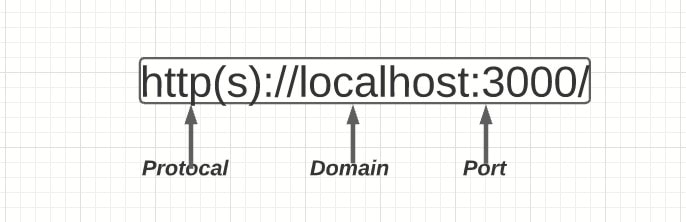

# Fetch API & CORS

## Fetch API

`Fetch API`는 `HTTP 파이프라인`을 구성하는 요청과 응답 등의 요소를 JavaScript에서 접근하고 조작할 수 있는 인터페이스를 제공합니다. `Fetch API`가 제공하는 `전역 fetch() 메서드`로 **네트워크의 리소스를 쉽게 비동기적**으로 가져올 수도 있습니다.

`fetch()` 함수는 첫번째 인자로 `URL`, 두번째 인자로 `옵션 객체`를 받고, `Promise 타입의 객체`를 반환합니다. 반환된 객체는, API 호출이 성공했을 경우에는 응답(response) 객체를 `resolve`하고, 실패했을 경우에는 `예외(error) 객체`를 reject합니다.

```js
fetch(url, options)
  .then((response) => console.log("response:", response))
  .catch((error) => console.log("error:", error));
```

### ReableStream

`ReadableStream` 인터페이스는 **바이트 데이터를 읽을수 있는 스트림**을 제공합니다. `Fetch API`는 Response 객체의 body 속성을 통하여 `ReadableStream`의 구체적인 인스턴스를 제공

#### Stream이란?

시간이 지남에 따라 사용할 수 있게 되는 일련의 데이터 요소라고 합니다.
> 즉, `순차적인 데이터`이다. 

#### 그럼 왜 Stream을 쓰는가?

데이터가 흘러가도록 하는 이유는 `메모리를 아끼기 위해서`입니다. 만약 100GB 단위의 데이터를 압축해서 zip 파일을 만들어야 한다고 가정하면 데이터 처리를 위해 SSD 상에서 데이터를 메모리로 로딩해야한다. 프로그램은 100GB의 큰 데이터를 전부 읽지 않아도 앞에서부터 차례대로 `처음부터 모든 데이터를 알 필요가 없이` 압축을 수행할 수 있다.

스트림에는 `읽기 전용(Readable) 스트림`과 `쓰기(Writable) 전용 스트림`이 있는데, 개발자 입장에서는 `읽기 전용(Readable) 스트림`이란 데이터가 스트림 내부에서 외부로 빠져나올 수 있다는 뜻이고, `쓰기(Writable) 전용 스트림`이란 갖고 있던 내 데이터를 내부로 전달할 수 있다는 뜻이다.

## Promise

`Promise`가 생성된 시점에는 알려지지 않았을 수도 있는 값을 위한 대리자로, 비동기 연산이 종료된 이후에 결과 값과 실패 사유를 처리하기 위한 처리기를 연결할 수 있습니다. `Promise`를 사용하면 비동기 메서드에서 마치 동기 메서드처럼 값을 반환할 수 있습니다. 다만 최종 결과를 반환하는 것이 아니고, 미래의 어떤 시점에 결과를 제공하겠다는 `Promise`을 반환합니다.

`Promise`는 다음 중 하나의 상태를 가집니다.

- `대기(pending)`: 이행하지도, 거부하지도 않은 초기 상태.
- `이행(fulfilled)`: 연산이 성공적으로 완료됨.
- `거부(rejected)`: 연산이 실패함.

```js
let promise = new Promise(function(resolve, reject) {
  // executor (제작 코드, '가수')
});
```

- `resolve(value)` — 일이 성공적으로 끝난 경우 그 결과를 나타내는 value와 함께 호출
- `reject(error)` — 에러 발생 시 에러 객체를 나타내는 error와 함께 호출

## Unicode

**전 세계의 모든 문자를 다루도록 설계된 표준 문자 전산 처리 방식**이다. 지구상에서 통용되는 대부분의 문자들을 담고 있으며, 언어를 표기할 때 쓰는 문자는 물론, 악보 기호, 이모지, 태그, 마작, 도미노 기호들도 포함된다.

## CORS

`CORS(Cross Origin Resource Sharing)`는 서로 다른 도메인간에 출처를 공유한다라는 뜻이다.
> 한 출처에 있는 자원에서 다른 출처에 있는 자원에 접근하도록 하는 개념이다.



위 구성요소 중에서 `Protocol + Host + Port` 3가지가 같으면 `동일 출처(Origin)`라고 합니다.

### SOP

`동일 출처 정책(same-origin policy)`은 어떤 `Origin`에서 불러온 문서나 스크립트가 다른 출처에서 가져온 리소스와 상호작용하는 것을 제한하는 중요한 보안 방식입니다. 동일 출처 정책은 잠재적으로 해로울 수 있는 문서를 분리함으로써 공격받을 수 있는 경로를 줄여줍니다.

보통 프론트엔드가 `localhost:8080`으로 개발 중인 상황에서, 백엔드 서버는 `localhost:5000`에서 호스팅 중인 상황이라면, `CORS 에러`라고 한다.

이를 세 가지 방법으로 해결할 수 있다.

- `프론트엔드` - Proxy Server 도입
- `백엔드` - Access-Control-Allow-Origin 응답 헤더 추가
- `백엔드` - CORS 미들웨어 사용하기
