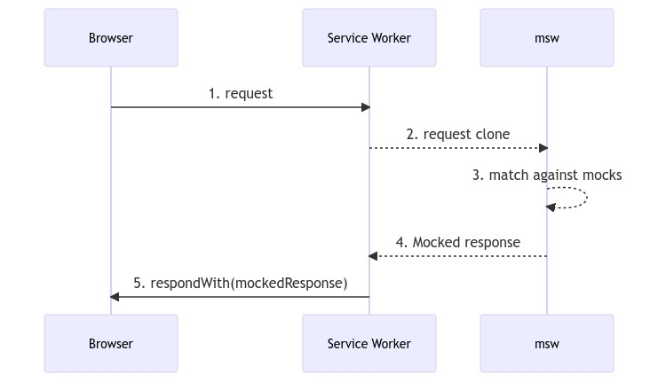

# MSW

## Service Worker

`Service Worker`는 기본적으로 웹 애플리케이션, 브라우저, 네트워크(사용 가능한 경우) 사이에 위치하는 프록시 서버 역할을 합니다.

`Service Worker`는 `origin` 및 `path`에 대해 등록된 이벤트 중심 워커이다. 연결된 웹 페이지를 제어하고 탐색 및 리소스 요청을 가로채 수정하여 리소스를 매우 세분화된 방식으로 캐싱하여 **네트워크를 사용할 수 없을 때 앱의 동작 방식**을 완벽하게 제어할 수 있는 `JavaScript` 파일의 형태를 취한다.

### 특징

- 무엇보다도 효과적인 **오프라인 경험**을 생성한다.
- 서버에 있는 에셋을 업데이트하는 데 목적이 있으며, 네트워크 요청을 가로채 네트워크 사용 가능 여부에 따라 적절한 조치를 취한다
- **푸시 알림 및 백그라운드 동기화 API**에 대한 액세스도 허용한다.
- JavaScript 모듈을 동적으로 `import`할 수 없으며, 서비스 워커 전역 범위에서 `import()`가 호출되면 throw된다. (`import`문을 사용한 정적 `import`는 가능)
- 보안상의 이유로 HTTPS를 통해서만 실행된다.

`Service Worker`는 `Worker Context`에서 실행되므로 DOM 엑세스 권한이 없으며 앱을 구동하는 메인 JavaScript와 다른 스레드에서 실행되므로 차단되지 않습니다. 또한 `Service Worker`는 **비동기화로 설계되어 동기식의 API들은 모두 사용할 수 없습니다.**

## MSW(Mock Service Worker)

`MSW`는 `Service Worker`를 사용하여 실제 네트워크 요청을 가로챈 후 `API Mocking` 을 보내주는 `API Mocking` 라이브러리이다. 즉, 백엔드 API인 척 프론트 요청에 따라 가짜 데이터를 응답해준다.

`MSW`를 사용하면, 직접 Mock 서버를 구현하지 않아도 네트워크 수준에서 API를 Mocking 할 수 있다.

### 동작원리

1. 브라우저가 `Service Worker`에 요청을 보냄
2. `Service Worker`가 해당 요청을 가로채서 복사함
3. 서버에 요청을 보내지 않고 `MSW` 라이브러리의 핸들러와 매칭
4. `MSW`가 등록된 핸들러에서 모의 응답을 `Service Worker`에 전달
5. `Service Worker`가 모의 응답을 브라우저에 전달

> `Service Worker`는 브라우저 환경에서만 실행 가능하다.

## Polyfill

기본적으로 지원하지 않은 이전 브라우저에서 최신 기능을 제공하는데 필요한 코드라고 정의한다. 최신 스팩 JavaScript 기능들을 오래된 브라우저에서 실행이 가능하게 하기 위해서는 `Polyfill` 문제를 해결해 줘야한다.

최근 브라우저에서는 대부분 표준 시맨틱에 따라 광범위한 API 세트를 구현하기 때문에 `Polyfill`을 사용하여 브라우저 별 구현을 처리하는 것은 최근에는 존재하지 않는다.

