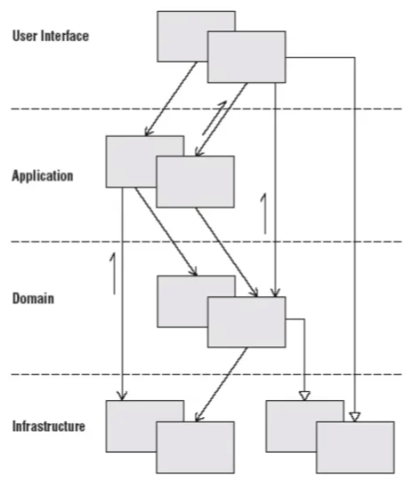

# External Store

## 관심사의 분리(`Separation of concerns, SoC`)

하나의 시스템은 작은 부품이 모여서 만들어진다. 우리는 이미 작은 컴포넌트를 합쳐서 더 큰 컴포넌트를 만드는 방식으로 개발을 진행하고 있다.

### 거대한 일을 쉽고 효율적으로 해나는 법

자동차의 핸들, 바퀴, 골격 등 각 분야를 나눠서 특정 부문만을 담당해 개발하고 이를 잘 조합하면 방법을 이용한다면 훨씬 수월하게 자동차를 만들어 낼 수 있다.

### 소프트워에 개발에서의 관심사 분리

특정한 관심사에 따라 기능을 나누고, 각 기능을 독립적으로 개발한 뒤 이를 조합하는 방식으로 복잡한 소프트웨어를 구성해보자는 아이디어를 `관심사의 분리(Separation of concerns, SoC)`라고 합니다. 보통 `Layered Architecture`에선 사용자에게 가까운 것과 사용자에게서 먼 것으로 구분한다. 아래와 같이 구분을 할 수 있다.

1. 가장 가까운 건 UI를 다루는 부분
2. `Business Logic`을 다루는 부분
3. 그 너머에는 데이터에 접근하고 저장하는 부분

각 부분은 하나의 역할, 나의 관심사로 격리됨으로써 복잡도를 낮추게 된다.

거대한 프로그램이 아니라고 해도 흔히 `Input` -> `Process` -> `Output`이란 3단계의 코드를 적절히 구분만 해도 코드를 이해하고 유지보수 하는데 큰 도움이 된다. 하나의 `Output`은 다시 사용자에게 `Input`을 요청하게 되고, 일반적인 프로그램은 다음과 같이 계속 순환하는 구조가 된다.

1. `Input`: 프로그램 시작
2. `Process`: 프로그램 초기화
3. `Output`: 사용자에게 초기 UI 보여주기
4. `Input`: 사용자의 입력
5. `Process`: 사용자의 입력에 따라 처리
6. `Output`: 처리 결과 보여주기
7. `Input`: 사용자의 또 다른 입력
8. …반복…

> 널리 알려진 MVC로 거칠게 매핑하면 다음과 같다.

- Model -> Process
- View -> Output
- Controller -> Input

## Layered Architecture

`Layered Architecture`는 `관심사의 분리`에 따라 시스템을 유사항 책임(관심)을 지닌 Layer로 분리하고 각각의 Layer가 하위 Layer에만 의존하도록 구성하는 아키텍쳐 패턴이다.

- **전체적인 시스템의 결합도를 낮춘다**.
- 개발자의 **인지 과부하를 방지**한다.
- **재사용성을 높이고 유지보수성을 향상** 시킨다.



### 사용자 인터페이스 계층(User Interface Layer)

- 사용자 화면을 구성하는 것에 관심이 있습니다.
- 사용자 인터페이스를 어떻게 구성하고 상호 작용은 어떻게 수행할지에 대한 책임을 가지고 있습니다.
- 화면을 직접 서비스하지 않는다면 클라이언트로부터 요청을 받고, 응답하는 API를 정의합니다.

### 어플리케이션 계층(Application Layer)

- 도메인 계층의 비즈니스 로직과 인프라스트럭처 계층의 데이터 접근 로직을 조율하는 것에 관심이 있습니다.
- 실제 비즈니스 로직보단 고수준(high-level)에서 추상화 된 어플리케이션 기능을 표현합니다.

### 도메인 계층(Domain Layer)

- 핵심 비즈니스 로직을 수행하는 것에 관심이 있습니다.
- 세부적인 기술이나 외부 관심사에 의존하지 않고, 격리된 상태에서 순수한 비즈니스 로직을 수행합니다.

### 인프라스트럭처 계층(Infrastructure Layer)

- 상위 계층에게 기술적인 부분을 지원하는 것에 관심이 있습니다.
- 기술 종속성이 강한 구현체를 제공하는 계층입니다.
- 영속성 프레임워크, 프레임워크 설정, 외부 API 요청 기능, 이벤트 리스너(listener) 등이 있습니다.

## Flux Architecture


Facebook(현 Meta)에서 MVC의 대안으로 내세운 아키텍처이다. `양방향 바인딩`을 썼을 때 생길 수 있는 `Model-View`의 복잡한 관계(전통적인 MVC에서는 지양하는 방식)를 겨냥해 명확히 `단방향 데이터 흐름`을 강조한다. 

1. `Action` → 이벤트/메시지 같은 객체
2. `Dispatcher` → (여러) Store로 Action을 전달. 메시지 브로커와 유사하다.
3. `Store (여러 개)` → 받은 Action에 따라 상태를 변경. 상태 변경을 알림.
4. `View` → Store의 상태를 반영한다.

Redux는 단일 Store를 사용함으로써 조금 더 단순한 그림을 제한한다.

1. `Action`
2. `Store` -> `Dispatch`를 통해 `Action`을 받고, 사용자가 정의한 `reducer`를 통해 `State`를 변경한다.
3. `View` -> `State`를 반영

`Action`을 **어떻게 표현하느냐가 사용성에 큰 차이**를 만든다. 하지만 상태를 UI에 반영하는 방법은 모두 동일하다.

3단계 프로세스와 거칠게 매핑하면 다음과 같다.

- `Input` → Action + dispatch
- `Process` → reducer
- `Output` → View(React)

### 단일 dispatcher

dispatcher는 Flux 어플리케이션의 중앙 허브로 모든 데이터의 흐름을 관리한다. 본질적으로 store의 콜백을 등록하는데 쓰이고 action을 store에 배분해주는 간단한 작동 방식으로 그 자체가 특별한 것은 아니다. 각각의 store에 직접 등록하고 콜백을 제공한다. action creator가 새로운 action이 있다고 dispatcher에게 알려주면 어플리케이션에 있는 모든 store는 해당 action을 앞서 등록한 callback으로 전달 받는다.

> 어플리케이션의 규모가 커지면 dispatcher의 역할은 더욱 필수 적이다!

store 간에 의존성을 특정적인 순서로 callback을 실행하는 과정으로 관리하기 때문이다. Store는 다른 store의 업데이트가 끝날 때까지 선언적으로 기다릴 수 있고 끝나는 순서에 맞춰 갱신된다.

### Stores

Store는 어플리케이션의 상태와 로직을 포함하고 있다. store의 역할은 많은 객체의 상태를 관리할 수 있는데 ORM 모델이 하는 것처럼 단일 레코드의 데이터를 표현하는 것도 아니고 Backbone의 컬랙션과도 다르다. store는 단순히 ORM 스타일의 객체 컬랙션을 관리하는 것을 넘어 어플리케이션 내에 개별적인 `도메인`에서 어플리케이션 상태를 관리한다.

store는 자신을 dispatcher에 등록하고 callback을 제공한다. 이 callback은 action을 파라미터로 받는다. store의 등록된 callback의 내부에서는 switch문을 사용한 action 타입을 활용해서 action을 해석하고 store 내부 메소드에 적절하게 연결될 수 있는 Hook을 제공한다.

> 결과적으로 action은 dispatcher를 통해 store의 상태를 갱신한다. 

store가 업데이트 된 후, 상태가 변경되었다는 이벤트 중계를 하는 과정으로 view에게 새로운 상태를 보내주고 view 스스로 업데이트하게 만든다.

### Views와 Controller-Views

React는 조화롭고 자유롭게 형태를 다시 렌더링 할 수 있는 view를 view 레이어로 제공한다. 복잡한 view 위계의 상위를 살펴보면 store에 의해 이벤트를 중계할 수 있는 특별한 종류의 view가 있는데 이를 controller-view 라고 부른다. store에서 데이터를 얻을 수 있는 glue 코드를 제공하고 데이터를 위계대로 자식들에게 전달하도록 돕는다. 페이지의 광범위한 영역을 관리하는 controller-view를 가지게 된다.

store에게 이벤트를 받으려면 store의 퍼블릭 getter 메소드를 통해 새로 필요한 데이터를 처음으로 요청하게 된다. 그 과정에서 `setState()`, `forceUpdate()` 메소드를 호출하게 되고 그 호출 과정에서 자체의 `render()` 메소드와 하위 모든 자식의 `render()` 메소드를 실행한다.

전체적인 store의 상태를 단일 객체로 만들어 하위에 있는 view에 전달하게 되는데 다른 자식들도 필요한 부분이라면 데이터를 사용할 수 있도록 한다. 또한 store의 전체 상태를 단일 객체로 흘려 보내는데 이 방식은 관리해야하는 프로퍼티 수를 줄이는 효과가 있다.

컴포넌트의 단순함을 유지하기 위해 위계 깊은 곳에서 controller-views가 추가적으로 필요할 때가 있다. 중간에 controller-views를 넣으면 특정 데이터 도메인에 관계된 위계 영역을 감싸서 독립적으로 만드는데 도움을 준다. 하지만 위계 내에서 만든 controller-view는 단일의 데이터 흐름과 상충해 잠재적으로 새로운 데이터 흐름의 시작점에서 충돌할 수 있다.

내부에 controller-view를 추가하는 것을 결정할 때에는 여러 데이터 업데이트의 흐름이 위계와 다른 방향으로 흐르지 않도록 고려해 단순함의 균형을 유지해야 한다. 여러 데이터가 업데이트 되면 이상한 효과를 만들어 React의 렌더링 메소드가 다른 controller-view에 의해 반복적으로 실행되서 디버깅의 어려움을 가중할 가능성이있다. 내부 controller-view를 만드는 것을 결정할 때, 데이터를 갱신하기 위해 위계에서 여러 방향으로 흐르는 복잡성에 반해 단순한 컴포넌트의 이점에서 균형을 찾아야 한다. 여러 방향으로의 데이터 갱신은 이상한 효과를 만들 수 있다. 특히 React의 렌더 베소드는 여러 controller-view를 갱신하기 위해 반복적으로 실행이 되어버려 디버깅의 어려움을 가중할 수도 있다.

### Action

dispatcher는 action을 호출해 데이터를 불러오고 store도 전달할 수 있는 메소드를 제공한다. action의 생성은 dispatcher로 action을 보낼 때 의미있는 핼퍼 메소드로 나누어진다. 

만약 todo 어플리케이션에서 todo 아이템의 문구를 변경하고 싶다고 했을 때 `updateText(todoId, newText)` 같은 함수를 이용해 `TodoActions` 모듈 내에 action을 만든다.(view의 이벤트 핸들러로부터 호출되어 실행할 수 있으며 사용자 상호작용에 응답 가능) action creator 메소드는 action이 store에서 해석될 수 있도록, 적절한 응답이 가능하도록 type을 추가할 수 있다.

ex) `TODO_UPDATE_TEXT`

action은 서버와 같은 다른 장소에서 올 수 있다. data 초기화 또는 서버에서 에러 코드를 반환 또는 어플리케이션이 제공된 후 업데이트가 있을 때 나타날 수 있다.

### Dispatcher에 대해서

dispatcher는 store 간의 의존성을 관리할 수 있다. 이 기능은 dispatcher 클래스에 포함된 `waitFor()` 메소드를 통해 가능하다.

TodoStore에 등록된 callback은 명시적으로 기다려 코드가 진행되는 동안 다른 의존성이 먼저 업데이트 되도록 기다린다.

```tsx
case 'TODO_CREATE':
  Dispatcher.waitFor([
    PrependedTextStore.dispatchToken,
    YetAnotherStore.dispatchToken
  ]);

  TodoStore.create(PrependedTextStore.getText() + ' ' + action.text);
  break;
```

`wairFor()`는 단일 인수만 받는데 discpatcher에 등록된 인덱스를 배열로 받는다. 이 인덱스는 대게 dispatch token 이라 부른다. 그러므로 `waitForm()`을 호출하는 store는 다른 store의 상태에 따라 어떤 방식으로 자신의 상태를 갱신할 수 있는지 알 수 있다.

dispatch token은 register() 메소드에서 반환하는데 이 메소드는 callback을 dispatcher에 등록할 때 사용된다.

```tsx
PrependedTextStore.dispatchToken = Dispatcher.register(function (payload) {
  // ...
})
```
