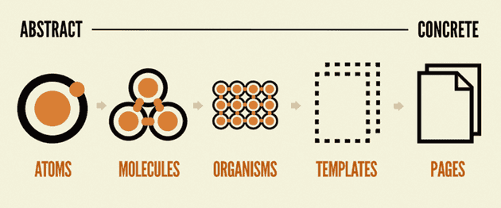

# Design System

## 반응형 웹 디자인

반응형 웹이란 쉽게 이야기하면 디바이스 종류에 따라 웹페이지의 크기가 자동적으로 재조정 죄는 것을 의미한다. 테스크탑, 테블릿, 모바일 등 어떠한 환경에서도 그에 맞게 사이즈가 변화되어 사용자가 보기 편리하게 만드는 웹이다.

> 장치의 크기와 기능에 따라 레이아웃이 달라집니다.

## 디자인 시스템

여러 페이지와 채널에서 공유 언어와 시각적 일관성을 유지하면서 중복을 줄여 대규모로 디자인을 관리하기 위한 일련의 표준입니다.

> 재사용 가능한 구성 요소와 패턴을 사용하여 대규모로 디자인을 관리하기 위한 완전한 표준 세트이다.

### 시각적 디자인 시스템

타이포그래피, 레이아웃, 모양 또는 형태 및 색상의 핵싱 구성요소로 구성(사용자의 흐름, 콘텐츠 전략, 카피 및 어조도 포함되어야 함)된다. 이렇게 핵심 구성 요소를 중심으로 생성된 개념 및 디자인 규칙은 제품 전체에 일관되게 사용되고 한 요소에서 다른 요소로, 페이지에서 페이지로 또는 뷰포트 너비에서 뷰포트 너비로 일관된 느낌을 생성한다.

### 반응형 디자인

디자인 시스템 구성요소에서 가장 중요한 고려 사항 중 하나다. 각 구성 요소에 대해 일관된 느낌을 유지하기 위해 뷰포트 전체에서 디자인을 통합할 항목과 다양한 뷰포트 크기에 대해 유연하고 최적의 경험을 제공하기 위해 디자인의 어떤 부분을 차별화 할지 결정한다.

`여러 뷰포트에서 동일하게 유지할 수 있는 구성 요소`

- 서체
- 기본 단위
- 색상
- 모양/형태

`뷰포트에서 차별화할 수 있는 구성 요소`

- 그리드
- 레이아웃
- 글꼴 크기
- 측정(선 길이)
- 행간(줄 높이)

> **컨텐츠는 항상 동일**해야하며, Mark Boulton이 이야기 한 것처럼 "캔버스를 디자인하는 것이 아니라 콘텐츠"를 디자인하는 것이다. 모든 디바이스에서 동일한 콘텐츠를 공유하고 디자인 시스템 구성 요소를 통해 콘텐츠를 가장 잘 표시하고 표현하는 방법에 집중해야한다.

아래는 여러 디자인 시스템의 사례들이다.

- [Atlassian Design System](https://atlassian.design/)
- [Material Design (Google)](https://material.io/)
- [Base Web (Uber)](https://baseweb.design/)
- [Polaris (Shopify)](https://polaris.shopify.com/)
- [Lightning Design System (Salesforce)](https://www.lightningdesignsystem.com/)
- [Mailchimp Pattern Library](https://ux.mailchimp.com/patterns)
- [Ant Design](https://ant.design/)

## Atomic design

화학적 관점에서 영감을 얻은 디자인 시스템입니다. 모든 것은 atom(원자)으로 구성되어있고 atom(원자)들이 서로 결합하여 molecule(분자)이 되고, molecule는 더 복잡한 organism(유기체)으로 결합하여 궁극적으로 모든 물질을 생성합니다. 아토믹 디자인에서는 이 개념을 차용해서 컴포넌트를 atom, molecule, organism, template, page의 5가지 레벨로 나눕니다.

[3주차 때 작성했던 Atomic design](../week3/react-component/atomic-design.md)
